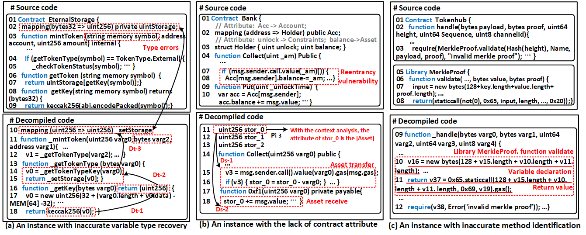
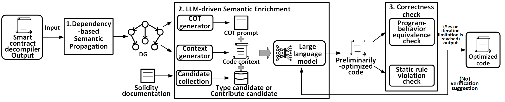

# Augmenting Smart Contract Decompiler Output via Hybrid Static Analysis and Large Language Models

***Current Decompiler Defects***

Current decompiler outputs contain defects that hinder downstream program analysis tasks, such as vulnerability detection and component analysis.

For the first time, we have systematically summarized the three main types of defects in current decompilers.

The first type is inaccurate variable type recovery. As shown in lines 1, 2, 10, and 11 of the figure, type errors are present in the decompiled code, which is detrimental to identifying specific vulnerabilities (such as overflow vulnerabilities).

The second type is the lack of important contract attribute information. This refers to semantic information represented by key state variables in smart contracts, such as account balance, whitelist, and address. The source code in the figure contains a re-entrancy vulnerability (lines 7-8), where the contract modifies the state variable balance after external calls. From the variable name, it's clear that the contract attribute corresponding to the state variable balance is account balance, making this vulnerability easy to identify. However, in the decompiled code (lines 11-13), balance becomes a meaningless variable name, making it difficult to infer contract properties and identify this vulnerability.

The third type is inaccurate method boundary recognition. As shown in the figure, there are two methods: handle and validate, but the decompiled code only shows the handle method. After careful comparison between the source code and decompiled code, we found that the validate method was incorrectly incorporated into the handle method (lines 10-11).

***OverView***

Our input is the output from smart contract decompilers.

First, we generate a dependency graph by extracting dependency relationships from the program through static analysis.

Next, based on the dependency graph and Solidity documentation, we generate prompts to guide the large language model in decompilation and code optimization.

For the initially optimized code, we perform two rounds of correctness validation. If validation succeeds, we generate the output. If it fails, we return to the large model for re-optimization.

## Quick Start

Here, we present the SmartHalo artifact, the evaluation dataset used to assess SmartHalo's effectiveness, the static violation rejection rules integrated into SmartHalo, and details of the manual summarization process for contract attribute candidates.

The usage method of this tool can be found in the smartHalo folder. You can click [here](./SmartHalo/README.md) to read.

## Dataset

This dataset contains the evaluation dataset used for our experiments in Section 5, as well as three vulnerability datasets used to evaluate effectiveness for downstream tasks in Section 6.

## SmartHalo

The artifact implemented according to our proposed decompiler output optimization method.

## API configuration

| Model Identifier      | Server Provider | Version/Release Date | Invocation Endpoints                                  | Context Length Limit | Repository Address                        |
|:----------------------|:----------------|:---------------------|:------------------------------------------------------|:---------------------|:-------------------------------------------|
| o4-mini               | Open AI         | 2025.4               | https://api.agicto.cn/v1                              | 20W                  | /                                          |
| GPT-4Turbo            | Open AI         | 2023.11              | https://api.agicto.cn/v1                              | 128K                 | /                                          |
| 4o-mini               | Open AI         | 2024.7               | https://api.agicto.cn/v1                              | 128K                 | /                                          |
| Qwen3-Coder-Plus      | Alibaba Cloud   | 2025.7               | https://dashscope-intl.aliyuncs.com/compatible-mode/v1 | 128K                 | https://github.com/QwenLM/qwen-code        |
| deepseek-r1           | DeepSeek        | 2025.1               | https://dashscope-intl.aliyuncs.com/compatible-mode/v1 | 128K                 | https://github.com/deepseek-ai/DeepSeek-R1 |
| llama 3.1 instruct 8B | Meta            | 2024.07              |                                                       | 128k                 | https://github.com/meta-llama/llama        |

## Static_Violation_Rejection_Rules.pdf

This documentation provides the static violation rejection rules integrated by SmartHalo in Section 4.3.

## The details of manual summarizing process for contract attribute candidates.pdf

This documentation provides the details of manual summarizing process for contract attribute candidates in Section 4.2

## Manual_Investigation_Results_for_Dataset

This documentation provides our manual investigation results on the evaluation dataset.

## Authors

Zeqin Liao **(Sun Yat-sen University)** [[liaozq8@mail2.sysu.edu.cn](mailto:liaozq8@mail2.sysu.edu.cn)] ,Yuhong Nan **(Sun Yat-sen University)** [[nanyh@mail.sysu.edu.cn](mailto:nanyh@mail.sysu.edu.cn)], Zixu Gao **(Sun Yat-sen University)** [[gaozx9@mail2.sysu.edu.cn](mailto:gaozx9@mail2.sysu.edu.cn)], Henglong Liang **(Sun Yat-sen University)** [[lianghlong@mail2.sysu.edu.cn](mailto:lianghlong@mail2.sysu.edu.cn)], Sicheng Hao **(Sun Yat-sen University)** [[haosch@mail2.sysu.edu.cn](mailto:haosch@mail2.sysu.edu.cn)], Peifan Reng **(Sun Yat-sen University)** [[rushfinen@gmail.com](mailto:rushfinen@gmail.com)], Zibin Zheng **(Sun Yat-sen University)** [[zhzibin@mail.sysu.edu.cn](mailto:zhzibin@mail.sysu.edu.cn)]
